# Microsoft Edge Chromium Developer Documentation

  * [Overview](#overview)
  * [First Steps](#first-steps)
  * [Digging Deeper](#digging-deeper)
    + [Settings](#settings)
    + [1. Elements Tab and Viewing the DOM](#1-elements-tab-and-viewing-the-dom)
    + [2. Console and Viewing Logged Messages](#2-console-and-viewing-logged-messages)
    + [3. Sources](#3-sources)
    + [4. Network Traffic](#4-network-traffic)
    + [5. Application  Cookies, Session Info and More](#5-application--cookies--session-info-and-more)


## Overview
Edge DevTools are web developer tools built directly into Microsoft Edge (Chromium) that can help you edit pages as you view them, diagnose and fix problems quickly resulting in faster and better web sites. With Edge DevTools you can make changes to the behind the scenes HTML that's rendered the page, and you can see instantly the change in your browser display. You can also step through and set break points in running JavaScript to figure out why things work, as well as discover how to fix those that do not.

## First Steps

To get started with Edge DevTools, browse to the site [USPresidents.azurewebsites.net](https://webapp20190426015338.azurewebsites.net/USPresidents.html).  This site simply uses Bootstrap 4 with some static image files. After browsing to the site, you launch Edge DevTools and Windows by pressing the keys `Command+Option+C` on a Mac or `Control+Shift+C` (Windows or Linux). Once you've done that, the Edge DevTools will appear on the bottom half of your display as shown below.

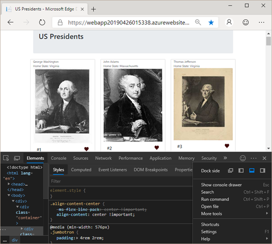

Notice the dark theme setting that appears in the Edge DevTools bottom section. in Edge Devtools this dark theme is configurable. It's easy to change as well as many other preferences.  Next, we'll  dig deeper into the DevTools settings as well as five of the major sections (tabs) available to you.

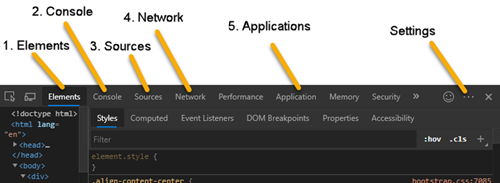

Learn how to start using these features in Edge DevTools.

## Digging Deeper

### Settings

To change you settings, or more specifically, say you want to change to a different theme, you first have to click on the three dots next to the `x` on the far right of the screen. You'll get a dialog with one of the choices for setting.

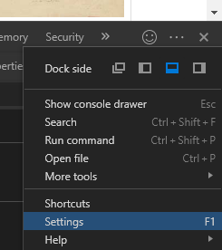

After clicking on the three dots, you'll get a panel that on top lets you change the appearance (or Theme) to Light, Dark, Light Chromium, or dark Chromium. Besides Appearance, there are a lot more settings available to you on the other tabs on the left side as shown here.

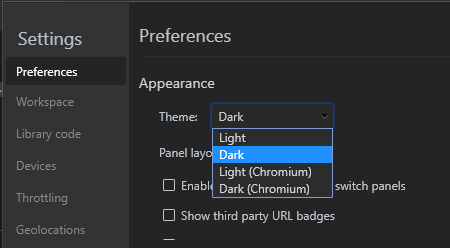

### 1. Elements Tab and Viewing the DOM

If you want to see what HTML elements are created that reflect what you are seeing on the browser display, the Elements tab will do that for you. Though I've not mentioned it yet, when you click the three dots like you did a moment ago to bring up settings, you can also choose where you want your Edge DevTools to be shown (undocked, left, bottom or right).  

I find that for inspecting the DOM, that is, when we use this elements tab, it's most conventient to have these tools docked to the right and not below as was the case earlier when we changed to the dark theme.

While mousing over an element I'll want to dig into, or in other words, inspect that elements HTML. I simply move my cusor to over what I want to inspect, then right mouse button, then choose `Inspect`. That automatically opens Edge DevTools and takes me directly to its elements tab

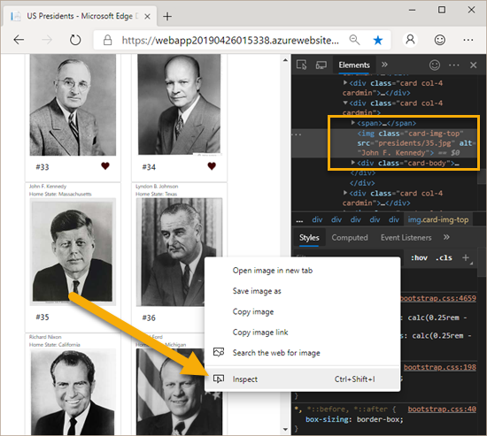

Notice the dev tools are now on the right side and just the first tab, `elements` is showing.

### 2. Console and Viewing Logged Messages

Web developers often log messages to the Console to make sure that their JavaScript is working as expected. To log a message, you put an expression like `console.log('hello console!')` in your JavaScript. When the Edge Browser executes your JavaScript and sees that code, it knows  to log the message to the Console. For example, say you have the following code at the bottom of your html page:

```HTML
    ...
    <script>
        (function () {
            console.log('hello from below the body tag on uspresidents.html!');
        })();
    </script>
</body>
</html>
```

When the browser loads this page with the Edge DevTools open to the console page, the console.log message is output as shown below.

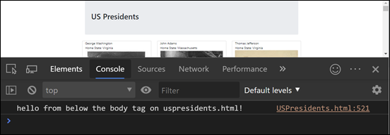

### 3. Sources

The `Sources` tab gives you a window into all the separate files that are downloaded on your web page typically requested directly by your primary HTML page. That is, the referenced css, JavaScript, manifest files, images, and more.  It's also the place that you can see and set break points in your running JavaScript files which very powerful.

The picture shows the `bootstrap.css` file used on our [USPresidents](https://webapp20190426015338.azurewebsites.net/USPresidents.html) site. Notice that you can hover over any of the colors and you'll get a nice color picker that you may want to use to change your css.

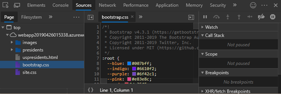

If you happen to be viewing either a JavaScript file, or an HTML file as we have below that contains script tags that enclose a JavaScript console.log line of code, you can directly set break points for debugging.  You can see I've got a break point set on line 521, and when the refreshed, the built in Edge DevTools debugger paused on that line of code. If we had variables, we could inspect them or even change them dynamically.  Pressing the continue button resumes the execution and the page display completes.

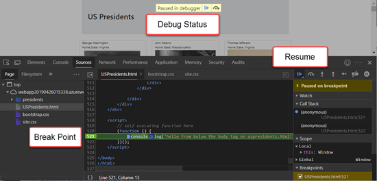

### 4. Network Traffic

The Edge DevTools network tab is probably the most often used diagnostic tool for figuring out what is going on with a web site.  It gives you a view into the main HTML page that your URL retrieved, as well as every asset (JavaScript file, image file, css, manifests, etc) that have been downloaded as part of your page.

Notice in the picture below, on the bottom left is the start of the downloaded assets.  First, is the page itself, that is the HTML file requested, `USPresidents.html`, next is `bootstrap.css`, then our `site.css` and finally all the images png files of our presidents.

The other columns of the download list include the HTTP status returned from network request.  200 means successful and 304 means Not Modifed (or cached).


Clicking one one of the lines of network traffic, say bootstrap.css for example, gives us more useful information about the request.  Notice it gives us the full Request URL, more details about the return status, the requesting IP address, referrer policy, whether the file was gzipped and more.

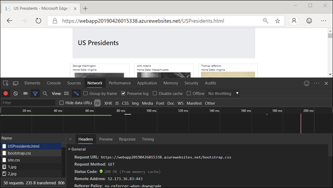

In addition now, we have access to other tabs of information about the request including a preview, response and timing panel. All with very useful information for us.

### 5. Application  (Cookies, Session Info and More)

The Application tab is very useful when you want to know more about information associated with what you could think of as the web application you are running when you browser to a URL.  That is, what cookies are associated with that URL, is there local or transient data being stored (like a shopping cart), is there a client side database (localdb for example), running on your behalf to make your web page more performant.  Outlined  below is three types of storage that can be stored alongside any domain in your browser.

#### Cookie Storage

You can see here on the left, the cookies that are associated with the domain you have browsed to.  As you know, the cookie would have been originally set in the original downloaded web request, but as it's stored, it persists for post back to other requests being served to this URL.

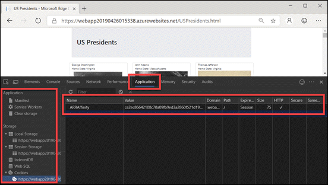

#### Session Storage

Transient data that is typically associated with a browser session can be vieweed here.  That is data that the server tracks as associated with your current visit of any given domain.  Typically, this is used to track things like a current logged in session.  You may want data saved between post backs to the server and this is a good place to store it.  The Edge DevTools let's you easily view that data as well as insert new data, update existing or delete existing data. Session data is always stored as key/value pairs.

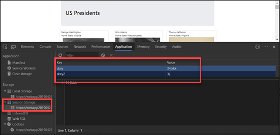

#### Local Storage

Local Storage is the type of data that can be stored in your browser relative to a given domain for long periods of time. Local Storage is often used a local repository of data so that each time you visit the site, the same data does not need to be downloaded again. It behaves very similarly to browser cache. With the Edge DevTools, this data can be inserted, updated or deleted. Local Storage is always stored as key/value pairs.


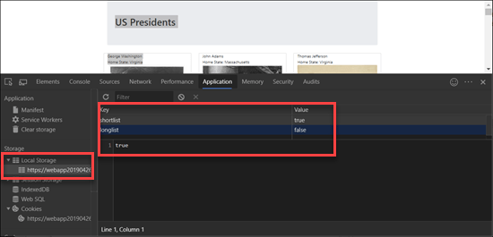

## Summary

Edge DevTools are chromium based and have a full suite of capabilities.  This article is just "Getting Started" and takes you through the basic without even touching on much of the capabilities that exist.  For example, we did not even talk about performance analysis, service workers, and many other features.


